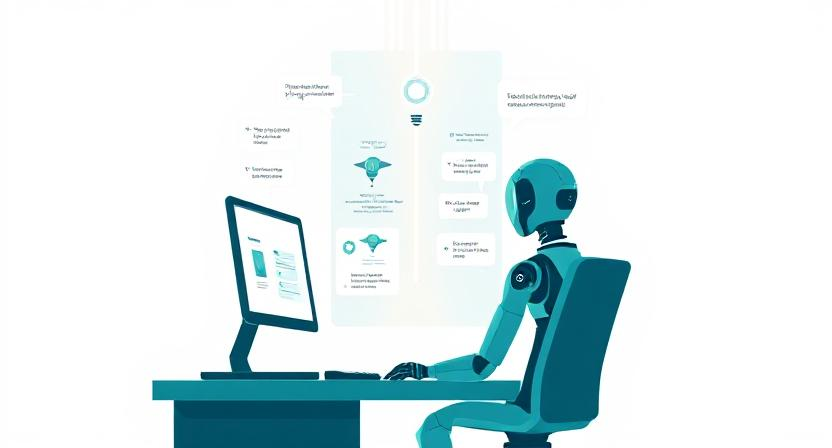

# Agentic Design Patterns: LLM-Powered Agents

Welcome to the Agentic Design Patterns project! This repository demonstrates how to build, use, and test different types of LLM-powered agents using Python. It is designed for beginners and educators interested in agentic workflows, tool use, and collaborative AI systems.

---

## Table of Contents
1. [Overview](#overview)
2. [Agent Types](#agent-types)
    - [1. Tool Agent](#1-tool-agent)
    - [2. React Agent](#2-react-agent)
    - [3. Self-Reflection Agent](#3-self-reflection-agent)
    - [4. Multi-Agent](#4-multi-agent)
3. [Usage Guide](#usage-guide)
4. [Running Tests](#running-tests)
5. [Using the GROQ Agent](#using-the-groq-agent)
6. [Advanced Usage](#advanced-usage)

---

## Overview
This project provides a hands-on introduction to agentic design patterns with Large Language Models (LLMs). You will learn how to:
- Build agents that can use tools (functions) to solve problems
- Chain reasoning and actions (ReAct pattern)
- Enable agents to self-reflect and improve their answers
- Create multi-agent systems for collaborative workflows

---

## Agent Types

### 1. Tool Agent


**ToolAgent** lets an LLM-powered agent call external functions ("tools") to answer user questions. The agent decides which tool to use and with what arguments, then combines the results with its own reasoning.

**Example use case:** Calculating the area of a circle, fetching weather data, or looking up information.

---

### 2. React Agent


**ReactAgent** implements the ReAct (Reasoning + Acting) pattern. The agent alternates between thinking (thoughts) and acting (tool calls), chaining multiple steps to solve complex problems.

**Example use case:** Planning a picnic by checking the weather, calculating blanket size, and recommending food in sequence.

---

### 3. Self-Reflection Agent


**SelfReflectionAgent** improves its answers by generating a response, critiquing it, and revising until satisfied. This loop helps the agent produce higher-quality, more accurate outputs.

**Example use case:** Writing and refining a story, code, or summary with iterative feedback.

---

### 4. Multi-Agent


**MultiAgent** systems allow multiple agents to work together, share context, and solve tasks collaboratively. Agents can depend on each other, forming workflows or pipelines.

**Example use case:** A team of agents planning a trip, where one researches destinations, another books hotels, and a third creates the itinerary.

---

## Usage Guide

1. **Install dependencies:**
   
   You can use either `pip` or [`uv`](https://github.com/astral-sh/uv) (a fast, modern Python package manager) to install dependencies. `uv` is recommended for faster installs and better dependency resolution.

   **With pip:**
   ```bash
   pip install -e .
   ```

   **With uv (recommended):**
   ```bash
   uv pip install -e .
   ```
   If you don't have `uv` installed, you can get it with:
   ```bash
   pip install uv
   # or
   pipx install uv
   ```

2. **Set up your environment:**
   - Make sure you have a `.env` file with your GROQ API key and any other required variables.
   - Example:
     ```env
     GROQ_API_KEY=your_groq_api_key_here
     ```

3. **Run an agent example:**
   - You can use the test files in `tests/agents/` as templates for your own scripts.
   - Example (from Python):
     ```python
     from src.agents.helpers.agent_factory import AgentFactory
     agent = AgentFactory.create(
         "tool",
         tools=[...],
         model="llama-3.3-70b-versatile",
         system_prompt="..."
     )
     output = agent.run(user_message="What is the weather in Paris?")
     print(output)
     ```

## Advanced Usage

Once you're comfortable with the basics, you can extend and customize your agentic workflows in powerful ways. Here are some ideas and tips:

### 1. Creating Your Own Tools
You can define your own functions and make them available to agents using the `@tool` decorator:

```python
from src.agents.helpers.tool import tool

@tool
def multiply(a: int, b: int) -> int:
    """Multiply two numbers."""
    return a * b
```

Add your tool to an agent:
```python
agent = AgentFactory.create(
    "tool",
    tools=[multiply],
    model="llama-3.3-70b-versatile",
    system_prompt="..."
)
```

---

### 2. Chaining Agents for Workflows
You can connect multiple agents together to form a pipeline or workflow. For example, one agent can generate a plan, and another can execute it:

```python
from src.agents.multi_agent import Agent

planner = Agent(
    name="Planner",
    backstory="Plans tasks step by step.",
    task_description="Plan a 3-step process for organizing a picnic.",
)
executor = Agent(
    name="Executor",
    backstory="Executes plans.",
    task_description="Carry out the plan provided by the Planner agent.",
)
planner >> executor  # Set dependency
planner.run()        # This will pass context to executor
executor.run()       # Executor uses the plan
```

---

### 3. Adding New Agent Types
You can create your own agent classes by subclassing or following the patterns in `src/agents/`. Register them in `AgentFactory` for easy use:

```python
class MyCustomAgent:
    # Implement your logic here
    ...

# Register in AgentFactory (edit agent_factory.py)
# elif agent_type == "mycustom":
#     return MyCustomAgent(**kwargs)
```

---

### 4. Customizing System Prompts and Tool Signatures
You can write your own system prompts to guide agent behavior, and customize tool signatures for clarity:

```python
SYSTEM_PROMPT = """
You are a math expert. Use the available tools to solve any math problem step by step.
<tools>
{tools}
</tools>
"""

agent = AgentFactory.create(
    "tool",
    tools=[multiply],
    model="llama-3.3-70b-versatile",
    system_prompt=SYSTEM_PROMPT
)
```

---

### 5. Using Logging for Debugging
All agents and tools use Python's logging system. You can adjust the log level in your `.env` file:

```
LOG_LEVEL=DEBUG
```

Check the `logs/` directory for detailed logs, or view output in your terminal. This helps you understand agent reasoning, tool calls, and errors.

---

For more ideas, explore the codebase, read the docstrings, and try combining agents and tools in new ways. The project is designed for experimentation and learning!

---

## Running Tests

To run all test cases and verify your setup:

```bash
pytest tests/agents/
```

- Each test demonstrates a different agent type and usage pattern.
- Check the logs in the `logs/` directory for detailed output and debugging information.

---

## Using the GROQ Agent

This project uses the [GROQ](https://groq.com/) API for LLM completions. To use the agents:

1. **Get a GROQ API key:**
   - Sign up at [groq.com](https://groq.com/) and obtain your API key.

2. **Set your API key:**
   - Add it to your `.env` file as `GROQ_API_KEY`.

3. **Run agents as shown above.**

---

## Contributing & Learning
- This project is designed for learning and experimentation. Feel free to fork, modify, and extend it!
- Each script and test is heavily documented for beginners.
- For questions or suggestions, open an issue or discussion.

Happy agent building! 🤖 